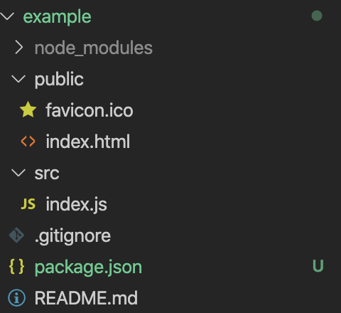
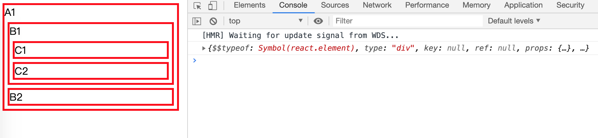

# 通过解析源码深入学习React，手写一个迷你 React

## 1. 搭建基本环境

使用 `create-react-app` 脚手架工具，创建一个 example 项目

```shell
npx create-react-app example
cd example
npm start
```


删除多余的文件




修改 src/index.js

```jsx
import React from 'react';
import ReactDOM from 'react-dom';

const style = {
  border: '3px solid red',
  margin: 5
}

const element = (
  <div id="A1" style={style}>
    A1
    <div id="B1" style={style}>
      B1
      <div id="C1" style={style}>C1</div>
      <div id="C2" style={style}>C2</div>
    </div>
    <div id="B2" style={style}>B2</div>
  </div>
)

console.log(element)

ReactDOM.render(
  element,
  document.getElementById('root')
);

```


将目录与 src/index.js 修改成跟上面一样后，使用 `npm start` 启动项目


## 2. 理解 JSX

官方文档：[jsx 简介](https://zh-hans.reactjs.org/docs/introducing-jsx.html)

JSX 是一种 Javascript 的语法扩展，语法类似于 HTML，代码看起来比使用函数编写 DOM 元素更加直观。

Bable 会把 JSX 转译成一个名为 `React.createElement()` 函数调用。

> 问：为什么写 react 代码的时候，没有用到 `React`，但也要 `import React from 'react'`？
>
> 答：因为 JSX 转译后会用到 `React.createElement`，虽然在我们编写的代码没有直接用到 `React`，但是转译后用到。如果不引入，转译后的程序就会找不到 `React.createElement`，导致报错。


示例启动后，浏览器访问 `http://localhost:3000/` ，打开控制台




可以看到，由示例代码中 `console.log(element)` 打印出来的内容，是一个对象，通过这个对象来描述 `element` 元素。

通过查看 http://localhost:3000/static/js/main.chunk.js，或使用 [babel 编译工具](https://www.babeljs.cn/repl)编译 `elment` 的内容

```jsx
const element = (
  <div id="A1" style={style}>
    A1
    <div id="B1" style={style}>
      B1
      <div id="C1" style={style}>C1</div>
      <div id="C2" style={style}>C2</div>
    </div>
    <div id="B2" style={style}>B2</div>
  </div>
)
```

可以看到 JSX 格式的 `element` 会被转译成类似下面的代码：

```javascript
"use strict";

var element = React.createElement("div", {
  id: "A1",
  style: style
}, "A1", React.createElement("div", {
  id: "B1",
  style: style
}, "B1", React.createElement("div", {
  id: "C1",
  style: style
}, "C1"), React.createElement("div", {
  id: "C2",
  style: style
}, "C2")), React.createElement("div", {
  id: "B2",
  style: style
}, "B2"));
```

`React.createElement()` 最终返回的是一个描述 DOM 节点 js 对象，所以 `console.log(element)` 打印出来的是一个js 对象。


## 3. 开始手写 react / react-dom 源码

### 3.1. React.createElement

官网文档：[React.createElement()](https://zh-hans.reactjs.org/docs/react-api.html#createelement)

上述内容可以得到代码中用到了 `React.createElement`，所以我们先了解一下这个函数，然后再来实现它。

```javascript
React.createElement(
  type,
  [props],
  [...children]
)
// type: 类型参数既可以是标签名字符串（如 'div' 或 'span'），也可以是 React 组件 类型 （class 组件或函数组件），或是 React fragment 类型。
// props: 元素的属性值对象（如：'id' 或 'class'）
// children: 子元素数组（使用了es6 语法 rest 参数 `...children`，意思是将第三个参数开始，后面全部参数都放入 children 数组中 ）
// 返回值：返回一个描述react元素的对象。
```

> 注：[阮一峰 ES6 文档 ：rest 参数](https://es6.ruanyifeng.com/#docs/function#rest-参数)

创建文件 `example/src/react.js`

```javascript

```


```javascript
// 把 import React from 'react'; 改为
import React from './react'; // 引入自己写的 react
```

